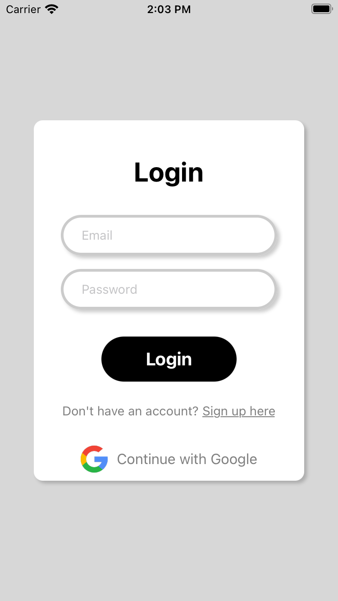
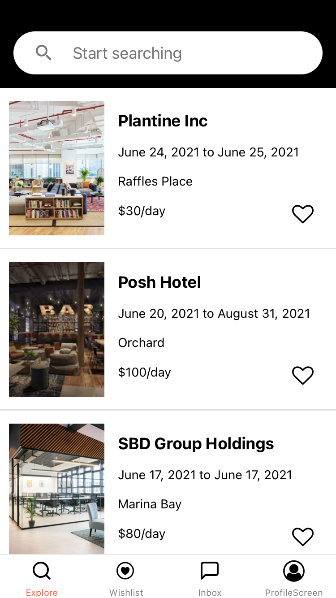
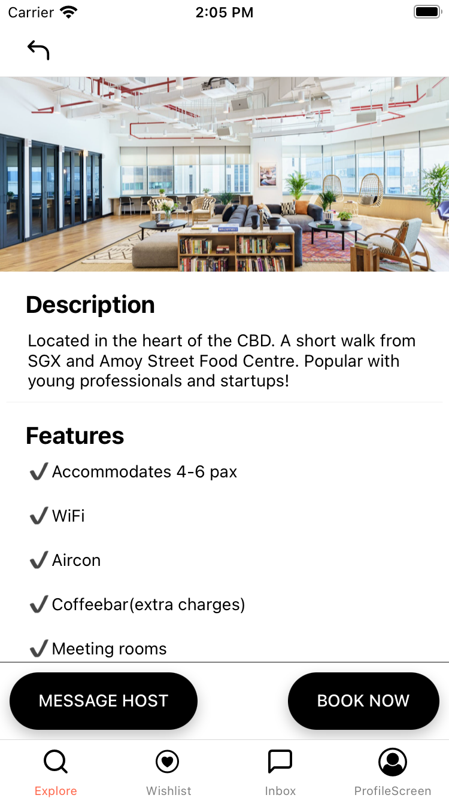
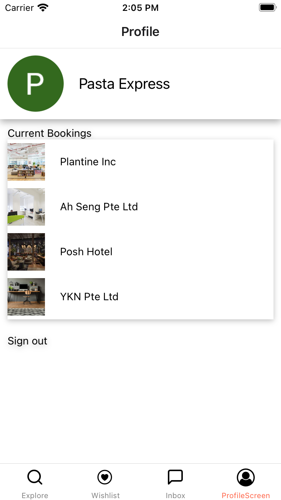
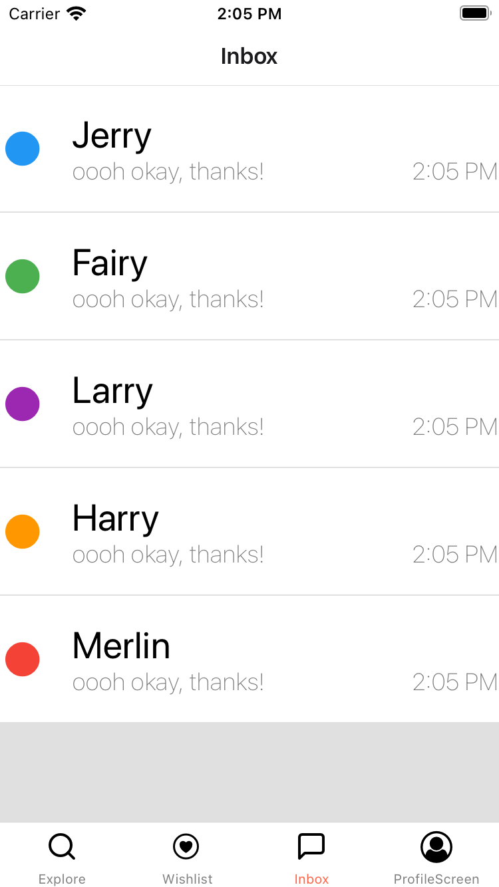
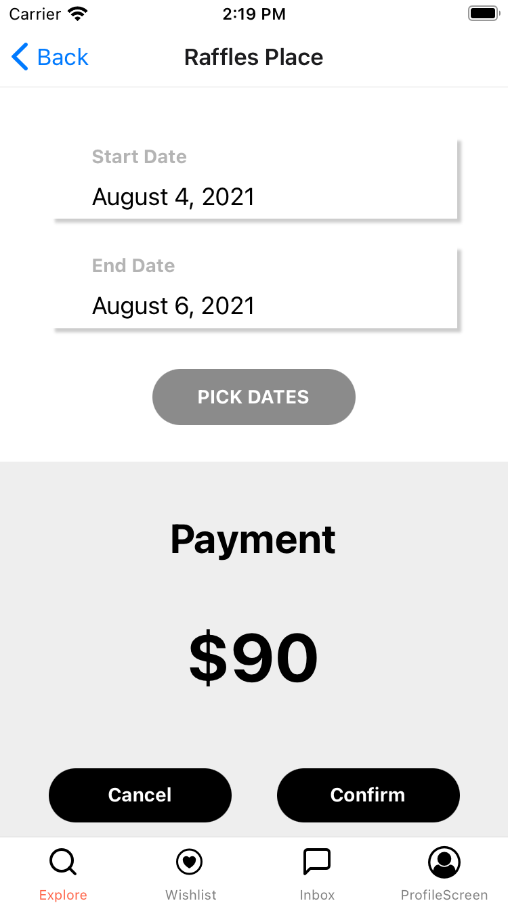

# WeShare

* :bulb: WeShare is an app for companies and venues with excess space that can be converted into work spaces, 
  and would like to lease them on a short term basis to offset rental costs.   
* :office_worker: WeShare is also an app for white collar workers seeking an alternative physical work environment, for reasons such as
  * Unavailable office as company does not rent office space.
  * Unconducive environment for remote working at home.
  * Craving a fresh environment.

### Problems addressed:

* With remote working increasingly becoming the norm, businesses can convert excess unused space into extra income.
* Workers previously priced out of a co-working space are able to choose where they want to work from. 
* **Goal** To efficiently manage the demand and supply of working spaces 

This is a project done as part of the [Brainhack 2021 CODE_EXP Competition](http://codeexp.tk.sg)

A video demo can be found [here](https://youtu.be/GbrkUGBdrq4)

## Some screenshots

Login page
 
 
 

 
 
 
Home page of the app
 
 
 

 
 
 
Individual listings
 
 
 

 
 
 
My profile
 
 
 

 
 
 
Inbox page
 
 
 

 
 
 
Booking page
 
 
 

## Team Members

> - [Keith](https://github.com/fairyinabottle4/)
> - [Danelynn](https://github.com/Icelenaugust/)
> - [Merlin](http://github.com/MerlinLim/)
> - [Kimberly](https://github.com/kimberlyohq/)
> - [Jerry](https://github.com/printinghelloworld/)
